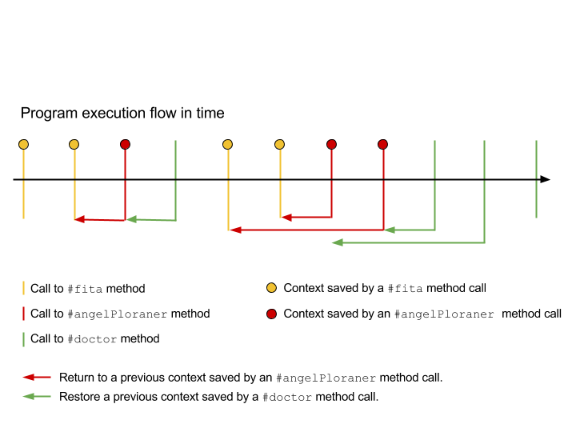

Blink - SmallTalk practice
===================

Project information
------------------

* Name:          Blink
* Main purpose:  Learn [Smalltalk](http://en.wikipedia.org/wiki/Smalltalk) and how to deal with [Continuations](http://en.wikipedia.org/wiki/Continuation). For further information, see the [attached report](assets/report.pdf).
* Subject:       [Conceptes Avançats de Programació (CAP)](http://www.fib.upc.edu/en/estudiar-enginyeria-informatica/assignatures/CAP.html)
* University:    [Barcelona School of Informatics (FIB-UPC)](http://www.fib.upc.edu/)
* Course:        2014-2015 Q1
* Delivery date: 2015-01-20
* Delivery mark: 10
* Team members:
  * [Ferrer González, Javier](https://twitter.com/JavierCane)
  * [Garcia i Oto, Pol](https://twitter.com/Ranirinn)

Brief explanation
------------------

Here you have an example of the program flow taking into account the methods implemented in the Blink package:

